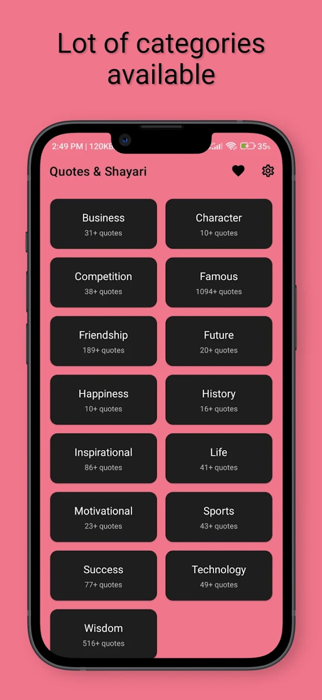
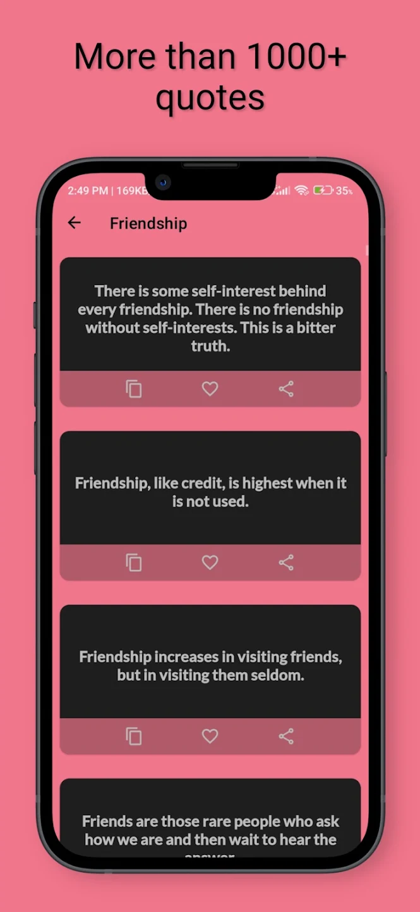
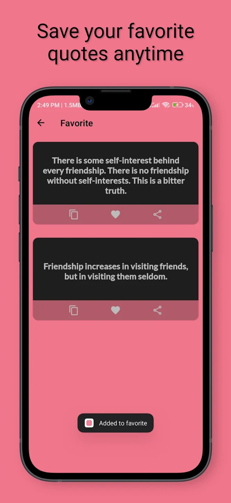
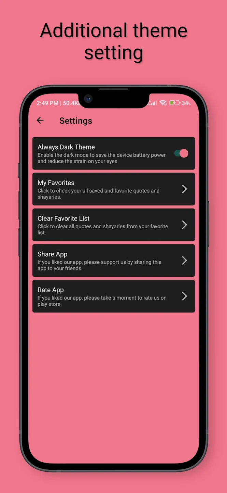

# 📚 English Quotes & Shayari App

A clean, elegant, and fully functional **Quotes & Shayari** Android application developed using **Java**. The app features a rich collection of thousands of quotes and Shayari across multiple categories, combined with modern design, light/dark themes, and in-app interactions like bookmarking, sharing, and liking.

This app is ideal for clients or businesses who want to launch a content-based app with built-in **monetization** features like **AdMob and Meta Audience Network mediation**.

---

## ✨ Features

- 🧾 1000+ curated **quotes** and **Shayari** in English
- 📚 Organized into multiple **categories** (Love, Life, Friendship, Motivation, Sad, and more)
- 🌙 Light and dark **theme switcher** for better readability
- ❤️ Bookmark and like your favorite quotes
- 🔗 **One-tap share** to WhatsApp, Instagram, or any social app
- 💰 Integrated with **AdMob** and **Meta Audience Network (mediation)** for monetization
- 🚀 Optimized performance with a **static local database** (scalable to SQLite/Firebase if needed)

---

## 🖼️ Screenshots

| Screenshot1 | Screenshot2 | Screenshot3 | Screenshot4 |
|-------------|------------|------------|------------|
|  |  |  |  |

---

## 🛠️ Tech Stack

- **Language:** Java (Native Android)
- **UI:** Modern Material Design
- **Storage:** Static local database (easily extendable to SQLite or Firebase)
- **Ad Network:** Google AdMob + Meta Audience Network (mediation)

---

## 👨‍💼 Client Use Cases

This app is perfect for:
- Publishers looking to launch a **quotes or Shayari app** with ad monetization
- Clients who want a **content-driven engagement app**
- Anyone looking to create a **minimal, fast, and offline-capable** app

---

## 📩 Contact

Interested in a custom version of this app, rebranding, or feature expansion?

📧 Email: me@sumitkmr.com

💼 Portfolio: https://sumitkmr.com/resume.html

